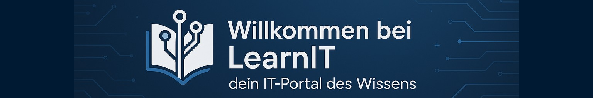

# Willkommen bei LearnIT 👋

**LearnIT** ist eine offene Plattform für IT-Lernende. Hier findest du übersichtlich alle Module, Lernziele und Zusammenfassungen aus deiner Ausbildung.

---

## Was erwartet dich?

✅ Modulübersichten nach Lehrjahr  
✅ Lernziele auf einen Blick  
✅ Zusammenfassungen von IT-Lernenden  
✅ Tipps zur Prüfungsvorbereitung  

---

## Mitmachen?

Diese Plattform lebt von Beiträgen aus der Community. Möchtest du etwas beitragen? Dann melde dich bei uns!

> 💡 Hinweis: Diese Seite befindet sich im Aufbau. Inhalte werden laufend ergänzt.
